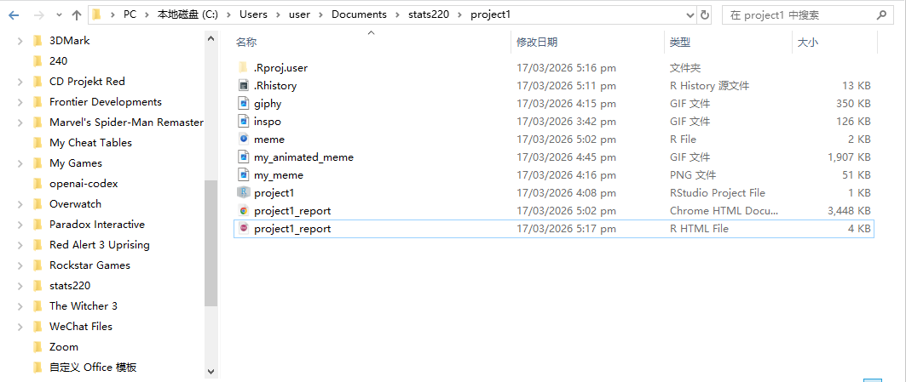
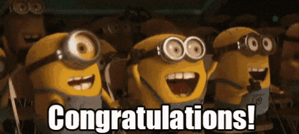
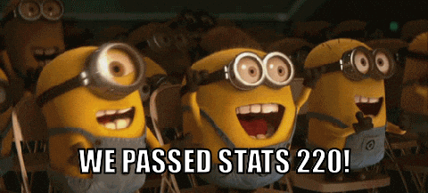

```{r setup, include=FALSE}
knitr::opts_chunk$set(echo=TRUE, message=FALSE, warning=FALSE, error=FALSE)
```

```{css}
body {
  font-family: "Trebuchet MS", "Gill Sans", sans-serif;
  background-color: #fffaf2;
  color: #2f2419;
  line-height: 1.7;
}

h1, h2 {
  color: #8b4a00;
}

h2 {
  border-bottom: 3px solid #f2b95f;
  padding-bottom: 0.3em;
  margin-top: 1.6em;
}

img {
  border: 4px solid #2f2419;
  border-radius: 12px;
  box-shadow: 6px 6px 0 #f2b95f;
  max-width: 100%;
}

a {
  color: #0c5c8c;
  font-weight: 600;
}
```

## Project requirements

This screenshot shows my `Project1` folder. It includes the RStudio project file `project1.Rproj`, the source files, the input images, and the final meme outputs.



My GitHub `stats220` repository is here: [stats220 repo](https://github.com/lateyoun9/stats220)

In my `meme.R` script, I used the required functions from `{magick}`, including `image_read()`, `image_annotate()`, `c()`, `image_animate()`, and `image_write()`. I also used named objects such as `giphy_frames` and `group_1`, pipes (`%>%`), comments, and clear indentation.

## Inspo meme



I chose this Minions meme as my inspiration because the characters already look excited, cheerful, and celebratory. The key components of the design are the happy facial expressions, the group reaction, and the sense of shared excitement. These features made it a strong starting point for a meme about passing STATS 220.

## My meme



For my meme, I kept the Minions celebration image but changed the text to **WE PASSED STATS 220**. I placed the caption at the bottom of the image in large white uppercase text with a black outline. I made this change so the meme would connect directly to my own experience in this course while still keeping the same excited mood as the inspo meme.

## My animated meme 


For the animated meme, I reused the same celebration theme but switched to `giphy.gif` as the moving background. I added four all-caps captions: `CONGRATULATIONS!`, `WE PASSED STATS 220`, `YEAHHH`, and `FINALY!`. I kept the text in the same bottom position in each section of the GIF so the animation looks consistent and easy to read. The final animation is saved as `my_animated_meme.gif`.

## Creativity
  
My project demonstrates creativity by turning a simple reaction image into a short animated story. The meme starts with congratulations, then connects the joke to STATS 220, then increases the excitement with `YEAHHH`, and ends with a final moment of relief. I also changed the visual style of the report with custom CSS, and I used a moving GIF background to make the final meme feel more lively than a static image alone.

## Learning reflection

This project helped me understand how R can be used for creative digital work as well as data work. I learned how `image_read()` imports images, how `image_annotate()` adds text to frames, and how `image_animate()` combines images into a GIF. I also learned that animation speed affects how viewers read the text, and that keeping the caption position consistent makes the meme clearer and more effective.

## Appendix

<mark>Do not change, edit, or remove the `R` chunk included below.</mark> 

If you are working within RStudio and within your Project1 RStudio project (check the top right-hand corner says "Project1"), then the code from the `meme.R` script will be displayed below.

This code needs to be visible for your project to be marked appropriately, as some of the criteria are based on this code being submitted.


```{r file='meme.R', eval=FALSE, echo=TRUE}

```

